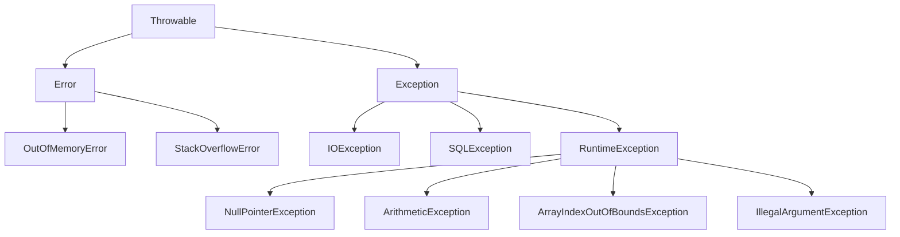

# 1. C’est quoi une exception ?

En Java, une **exception**, c’est une **erreur qui arrive pendant l’exécution** du programme.

Exemples classiques :

* Division par zéro
* Accès à un index de tableau invalide
* Utilisation d’une variable à `null`
* Fichier introuvable

Si l’exception n’est pas gérée → le programme s’arrête avec un message d’erreur.

<br/>­

# 2. `try` / `catch` : le cœur de la gestion d’exception

On met le code qui peut provoquer une erreur dans un bloc `try`.
Si une erreur arrive, Java exécute le bloc `catch`.

```java
public class TestExceptions {
    public static void main(String[] args) {
        try {
            int a = 10;
            int b = 0;
            int resultat = a / b;   // Erreur ici : division par zéro
            System.out.println(resultat);
        } catch (ArithmeticException e) {
            System.out.println("Erreur : division par zéro.");
        }

        System.out.println("Fin du programme.");
    }
}
```

Idée simple :

* `try` → “j’essaie ce code”
* `catch` → “si ça plante, je réagis ici”

<br/>­

# 3. Exemple avec `NullPointerException`

```java
public class TestNull {
    public static void main(String[] args) {
        String nom = null;

        try {
            System.out.println(nom.length()); // Provoque NullPointerException
        } catch (NullPointerException e) {
            System.out.println("Erreur : la variable 'nom' vaut null.");
        }
    }
}
```

<br/>­

# 4. `finally` : ce qui s’exécute toujours

Le bloc `finally` est optionnel, mais s’exécute **dans tous les cas** :
– qu’il y ait une exception ou non.

```java
public class TestFinally {
    public static void main(String[] args) {
        try {
            int[] tab = {1, 2, 3};
            System.out.println(tab[5]); // Index invalide
        } catch (ArrayIndexOutOfBoundsException e) {
            System.out.println("Erreur : index du tableau invalide.");
        } finally {
            System.out.println("Bloc finally exécuté (nettoyage, fermeture, etc.).");
        }
    }
}
```

<br/>­

# 5. Résumé 

* Une **exception** = erreur à l’exécution.
* `try` contient le code “à risque”.
* `catch` gère l’erreur et évite le crash brutal.
* `finally` s’exécute quoi qu’il arrive (facultatif).

Forme générale :

```java
try {
    // Code qui peut provoquer une exception
} catch (TypeException e) {
    // Réaction si erreur
} finally {
    // (Optionnel) Toujours exécuté
}
```

<br/>­

# 6. Exemple à tester 

```java
public class DivisionSafe {
    public static void main(String[] args) {
        int a = 5;
        int b = 0;

        try {
            int resultat = a / b;
            System.out.println("Résultat = " + resultat);
        } catch (ArithmeticException e) {
            System.out.println("On ne peut pas diviser par zéro.");
        }

        System.out.println("Programme terminé.");
    }
}
```


<br/>­

# 7. Arboresnce des exceptions



> En Java, `Error` et `Exception` héritent tous les deux de `Throwable`, mais ne servent pas au même objectif.
Un **`Error`** représente un problème grave lié à la JVM ou au système (manque de mémoire, stack overflow) dont l’application ne peut généralement pas se remettre.
On **ne cherche pas** à gérer un `Error` avec `try/catch` dans le code métier, car l’environnement d’exécution lui-même est en difficulté.
Une **`Exception`** représente une erreur fonctionnelle ou logique (fichier introuvable, entrée invalide, problème réseau) que le programme est censé prévoir et traiter.
En pratique : `Error` = problème système critique, `Exception` = erreur applicative à gérer proprement.


### 7.1. `IOException`

Lecture d’un fichier qui n’existe pas :

```java
import java.io.*;

public class ExempleIOException {
    public static void main(String[] args) {
        try {
            FileReader fr = new FileReader("inexistant.txt"); // IOException
        } catch (IOException e) {
            System.out.println("Fichier introuvable : " + e.getMessage());
        }
    }
}
```


### 7.2. `SQLException`

Connexion à une BD avec une URL invalide :

```java
import java.sql.*;

public class ExempleSQLException {
    public static void main(String[] args) {
        try {
            Connection conn = DriverManager.getConnection(
                "jdbc:mysql://localhost:3306/mauvaiseBD",
                "user",
                "motdepasse"
            ); // SQLException probable
        } catch (SQLException e) {
            System.out.println("Erreur SQL : " + e.getMessage());
        }
    }
}
```


### 7.3. `NullPointerException`

Utilisation d’une référence à `null` :

```java
public class ExempleNullPointer {
    public static void main(String[] args) {
        String nom = null;
        System.out.println(nom.length()); // NullPointerException
    }
}
```


### 7.4. `ArithmeticException`

Division par zéro :

```java
public class ExempleArithmetic {
    public static void main(String[] args) {
        int a = 10;
        int b = 0;
        int res = a / b; // ArithmeticException: / by zero
    }
}
```


### 7.5. `ArrayIndexOutOfBoundsException`

Accès à un index invalide dans un tableau :

```java
public class ExempleArrayIndexOutOfBounds {
    public static void main(String[] args) {
        int[] tab = {1, 2, 3};
        System.out.println(tab[5]); // ArrayIndexOutOfBoundsException
    }
}
```


### 7.6. `IllegalArgumentException`

Argument invalide passé à une méthode :

```java
public class ExempleIllegalArgument {
    public static void main(String[] args) {
        setAge(-5); // IllegalArgumentException
    }

    public static void setAge(int age) {
        if (age < 0) {
            throw new IllegalArgumentException("L'âge ne peut pas être négatif.");
        }
        // ...
    }
}
```


<br/>

# Annexe 1


- En Java, une **exception checked** doit obligatoirement être déclarée avec `throws` ou entourée d’un `try/catch`, sinon le code ne compile pas (ex. `IOException`, `SQLException`).
- Les exceptions checked représentent des problèmes externes prévisibles : fichiers, réseau, base de données, etc., que l’on est censé gérer explicitement.
- Une **exception unchecked** (ou **RuntimeException**) n’est pas imposée par le compilateur : on peut la laisser remonter sans `throws` ni `try/catch` (ex. `NullPointerException`, `ArithmeticException`, `IllegalArgumentException`).
Les exceptions unchecked représentent souvent des bugs de programmation ou des erreurs de logique (mauvais index, argument invalide, variable `null`).
- En résumé : **checked = obligatoires à gérer / déclarer**, **unchecked = facultatives à gérer mais généralement révélatrices d’un problème dans le code**.


| Exception                        | Type                    | Quand ça arrive ?                                               | Message typique                             |
| -------------------------------- | ----------------------- | --------------------------------------------------------------- | ------------------------------------------- |
| `IOException`                    | **Checked**             | Problème d’entrée/sortie (fichier manquant, lecture impossible) | `No such file or directory`                 |
| `SQLException`                   | **Checked**             | Erreur avec la base de données (connexion, requête, driver…)    | `Communications link failure`, etc.         |
| `NullPointerException`           | **Unchecked (Runtime)** | Utilisation d’une référence `null`                              | `Cannot invoke "X.y()" because ... is null` |
| `ArithmeticException`            | **Unchecked (Runtime)** | Division par zéro, calcul arithmétique impossible               | `/ by zero`                                 |
| `ArrayIndexOutOfBoundsException` | **Unchecked (Runtime)** | Index de tableau en dehors des bornes                           | `Index 5 out of bounds for length 3`        |
| `IllegalArgumentException`       | **Unchecked (Runtime)** | Argument invalide passé à une méthode                           | `Invalid value for ...`                     |


### Mini-exemples de code

```java
// IOException
FileReader fr = new FileReader("inexistant.txt"); // IOException
```

```java
// SQLException
Connection c = DriverManager.getConnection("jdbc:mysql://localhost:3306/mauvaiseBD", "user", "pwd"); // SQLException
```

```java
// NullPointerException
String nom = null;
System.out.println(nom.length()); // NullPointerException
```

```java
// ArithmeticException
int a = 10, b = 0;
int r = a / b; // ArithmeticException
```

```java
// ArrayIndexOutOfBoundsException
int[] t = {1, 2, 3};
System.out.println(t[5]); // ArrayIndexOutOfBoundsException
```

```java
// IllegalArgumentException
void setAge(int age) {
    if (age < 0) {
        throw new IllegalArgumentException("L'âge ne peut pas être négatif.");
    }
}
```

<br/>

# Annexe 2


## 1. L’idée générale : "faire remonter” l’erreur"

Quand une erreur se produit dans une méthode, il y a deux possibilités :

1. **La gérer sur place** avec `try { ... } catch (...) { ... }`
2. **Ne pas la gérer ici**, et la **laisser remonter** à la méthode appelante

C’est là qu’interviennent les mots-clés :

* `throw` → **lancer** (créer et envoyer) une exception à un instant précis.
* `throws` → **dire dans la signature** : “cette méthode peut lancer telle exception”.


## 2. `throw` : lancer une exception à un endroit précis

`throw` s’utilise **dans le corps** d’une méthode.

Exemple simple : on interdit une division par zéro avec un message clair.

```java
public class MathsUtil {

    public static int diviser(int a, int b) {
        if (b == 0) {
            // On crée et on lance une exception
            throw new IllegalArgumentException("b ne doit pas être égal à 0.");
        }
        return a / b;
    }
}
```

* `new IllegalArgumentException("...")` → on crée l’objet exception.
* `throw` → on le lance.
* Si personne ne la rattrape (`catch`), le programme s’arrête avec un message.

Ici, `IllegalArgumentException` est une **unchecked** (Runtime), donc **pas besoin** de `throws` dans la signature.


## 3. `throws` : déclarer que la méthode peut lancer une (ou plusieurs) exceptions

Pour les exceptions **checked** (comme `IOException`), le compilateur oblige à dire :

> “Attention, cette méthode peut lancer telle exception.”

On le fait dans la **signature** :

```java
import java.io.BufferedReader;
import java.io.FileReader;
import java.io.IOException;

public class FichierUtil {

    public static String lirePremiereLigne(String chemin) throws IOException {
        BufferedReader br = new BufferedReader(new FileReader(chemin));
        String ligne = br.readLine();
        br.close();
        return ligne;
    }
}
```

Ici :

* `throws IOException` dans la signature = **déclaration**.
* À l’intérieur, des opérations peuvent lancer un `IOException`.
* La méthode **ne gère pas** l’exception, elle dit juste :
  “Si ça plante, je laisse l’erreur remonter.”


## 4. Comment la méthode appelante récupère l’exception

Maintenant, une autre méthode appelle `lirePremiereLigne`.
Deux choix :

### 4.1. Gérer l’exception ici (try/catch)

```java
public class Main {
    public static void main(String[] args) {
        try {
            String ligne = FichierUtil.lirePremiereLigne("data.txt");
            System.out.println("Première ligne : " + ligne);
        } catch (IOException e) {
            System.out.println("Impossible de lire le fichier : " + e.getMessage());
        }

        System.out.println("Programme terminé.");
    }
}
```

* `lirePremiereLigne` déclare `throws IOException`
* `main` **attrape** l’exception avec `catch (IOException e)`
* Le programme peut continuer proprement.

### 4.2. Laisser encore remonter (re-throws)

Une méthode intermédiaire peut **simplement relayer** :

```java
public class Service {

    public void afficherFichier(String chemin) throws IOException {
        // ne gère pas l'erreur, la laisse remonter
        String ligne = FichierUtil.lirePremiereLigne(chemin);
        System.out.println("Contenu : " + ligne);
    }
}
```

Puis, dans `main` :

```java
public class Main {
    public static void main(String[] args) {
        Service service = new Service();

        try {
            service.afficherFichier("data.txt");
        } catch (IOException e) {
            System.out.println("Erreur lors de l'affichage du fichier : " + e.getMessage());
        }
    }
}
```

**Chaîne complète :**

`main` → `afficherFichier` → `lirePremiereLigne`
L’exception part du bas et remonte jusqu’à la première méthode qui a un `try/catch`.


## 5. Combiner `throw` et `throws` (avec une exception personnalisée)

### 5.1. On crée une exception métier

```java
public class SoldeInsuffisantException extends Exception {
    public SoldeInsuffisantException(String message) {
        super(message);
    }
}
```

> Ici, elle hérite de `Exception` → c’est une **checked**.

### 5.2. On lève l’exception avec `throw`

```java
public class CompteBancaire {
    private double solde = 0;

    public CompteBancaire(double soldeInitial) {
        this.solde = soldeInitial;
    }

    public void retirer(double montant) throws SoldeInsuffisantException {
        if (montant > solde) {
            // ICI on lève l'exception
            throw new SoldeInsuffisantException(
                "Solde insuffisant : " + solde + ", montant demandé : " + montant
            );
        }
        solde -= montant;
    }

    public double getSolde() {
        return solde;
    }
}
```

* `throws SoldeInsuffisantException` dans la signature → annonce que cette méthode peut échouer.
* `throw new SoldeInsuffisantException(...)` dans le corps → **lancement** réel de l’exception.

### 5.3. La méthode appelante gère l’exception

```java
public class Main {
    public static void main(String[] args) {
        CompteBancaire compte = new CompteBancaire(100);

        try {
            compte.retirer(150); // va lancer SoldeInsuffisantException
            System.out.println("Retrait effectué.");
        } catch (SoldeInsuffisantException e) {
            System.out.println("Erreur : " + e.getMessage());
        }

        System.out.println("Solde final : " + compte.getSolde());
    }
}
```


## 6. Résumé 

* `throw` = **action** → “À cet endroit précis, je lance cette exception.”
* `throws` = **contrat de méthode** → “Cette méthode peut lancer ce type d’exception.”
* Une exception peut **remonter** de méthode en méthode jusqu’à tomber sur un `try/catch`.
* Les exceptions **checked** (comme celles qui étendent `Exception`) doivent être **déclarées avec `throws`** ou gérées immédiatement.
* Les exceptions **unchecked** (Runtime) peuvent être lancées avec `throw`, mais leur déclaration avec `throws` est optionnelle.


